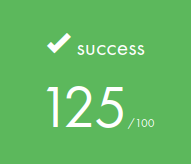

# libft

  

   
This project is our very first project as students at 42. We will need to recode a few functions of the C standard library as well as some other utility functions that we will use during our whole cursus.
  
  

